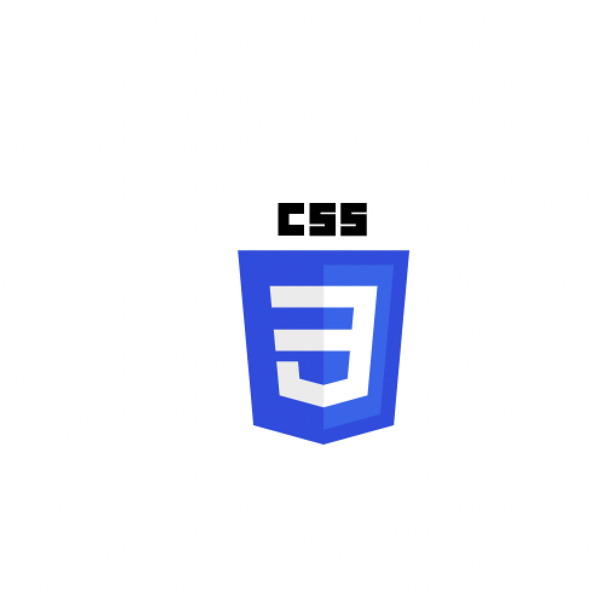
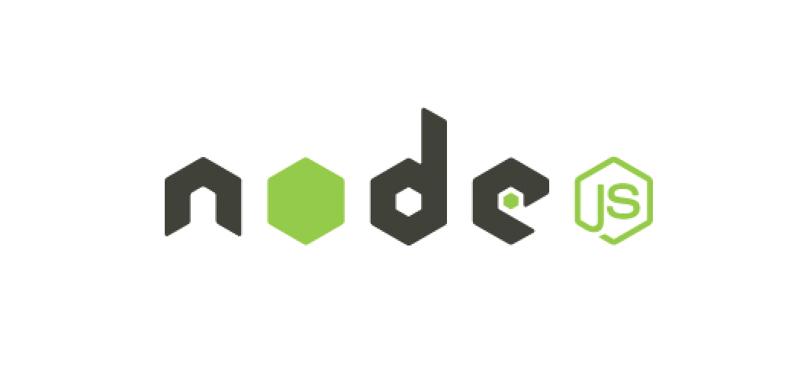

<h1>Hey, I'm Andre 👋 </h1>
<strong>I’m a Data Engineer with interest in Data Science/Machine Learning/AI</strong>

My professional experience has taught me to be a great team player, an attentive listener and enhanced my attention to detail. This alongside my educational accomplishments enable me to pursue my career goals and follow my passions in Technology and Business.

I hold a First Class Honours degree in Business Management from The Open University Business School. This was accomplished while working full-time and took a great deal of organisational and time management skills.

I love to learn new skills, I began my journey in tech with Web development and since then I never stopped up-skill. I hold a certificate in Responsive Web Development from freeCodeCamp by self-taught online, here I learned HTML, CSS and JavaScript. I also hold a certificate in Web Development from Bath Spa University, where I learned an understanding of Semantic HTML, CSS, LESS, Bootstrap, JavaScript, React, Node.js, prototyping in Figma and work with browser tools. Both of these certificates were accomplished while working full-time.

From there, I reflected, and realised that my passion is working with data, since my Business studies I always enjoyed doing business analysis and finding data insights.
I did 3 months intensive training in Data engineering using Python and SQL and hold a certification of accomplishment. Alongside that, I also hold various Azure Data Engineering, Cloud computing, Data Science and AI as well as Databricks certifications.

<ul>
<li>💞️ I’m looking to collaborate on open source projects alongside my work.</li>
<li>⚡️ Tech, Programming, Football, Sports, travelling and hiking are my passions.</li>
</ul>
👨🏻‍💻 Happy Coding!

<h2>Front-End Stack</h2>
<table>
  <tr>
     <td align="center" width="96">
      
       HTML
    </td>
       <td align="center" width="96">
      
       CSS
    </td>
      <td align="center" width="96">
      
       Javascript
    </td>
    </table>
    <h2>Back-End Stack</h2>
<table>
  <tr>
     <td align="center" width="96">
      
       Python
    </td>
       <td align="center" width="96">
      
          SQL
    </td>
 </table>
    <h2> Runtime environment</h2>
    <table>
     <td align="center" width="96">
      
       Node.js
    </td>
    </table>
    <h2>Libraries</h2>
    <table>
    <td align="center" width="96">
      
       React
    </td>
  </table>
     <h2>Design Frameworks</h2>
    <table>
      <td align="center" width="96">
      
       Bootstrap
    </td>
    <td align="center" width="96">
      
       LESS
    </td>
    </table>
    <h2>Prototyping</h2>
    <table>
    <td align="center" width="96">
      
       Figma
    </td>
  </table>
    <h2>Cloud</h2>
    <table>
    <td align="center" width="96">
      
       Azure
    </td>
    <td align="center" width="96">
      
       Databricks
    </td>
    <td align="center" width="96">
      
       AWS
    </td>
  </tr>
  </table>
